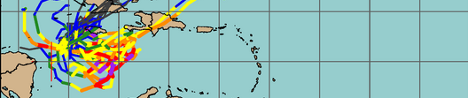

========================================================================================================
SAMURAI Winds and Intensity in Forecasting Time Objective Best Track (SWIFT-OBT) version |version|
========================================================================================================
Developed by the `Research Applications Laboratory <https://ral.ucar.edu/>`_, Boulder, CO and `Colorado State University <https://www.atmos.colostate.edu/>`_, Fort Collins, CO

History
-------
SWIFT-OBT is an integrated analysis platform that comprises a number of extensive tropical cyclone (TC) observational processing and analysis capabilities. As of the  v0.1 release in May 2024, SWIFT-OBT now integrates these capabilities into an extensible analysis framework that will be demonstrated in real-time during the 2024 and 2025 hurricane seasons.

The purpose of this documentation is to provide guidance on how to install and use the SWIFT-OBT system in real-time and retrospective settings.

Acronyms
--------

* **NCAR** - National Center for Atmospheric Research
* **CSU** - Colorado State University
* **UM** - University of Miami
* **NOAA** - National Oceanic and Atmospheric Administration
* **NHC** - National Hurricane Center
* **HRD** - Hurricane Research Division

Authors
-------

To cite this documentation in publications, please refer to the T-CART User's Guide :ref:`Citation Instructions<citations>`.

* Jonathan L. Vigh [#RAL]_
* Michael M. Bell [#CSU]_
* Jun A. Zhang [#CIMAS]_, [#HRD]_
* Eric A. Hendricks [#RAL]_
* Christopher M. Rozoff [#RAL]_
* Alex J. DesRosiers [#CSU]_
* Jennifer C. DeHart [#CSU]_

.. rubric:: Organization

.. [#RAL] `National Center for Atmospheric Research, Research
       Applications Laboratory (NCAR/RAL) <https://ral.ucar.edu/>`_

.. [#CSU] `Colorado State University, Department of Atmospheric Science (CSU) <https://www.atmos.colostate.edu/>`_

.. [#CIMAS] `University of Miami, Cooperative Institute for Marine and Atmospheric Studies (UM/CIMAS) <https://cimas.earth.miami.edu/>`_

.. [#HRD] `National Oceanic and Atmospheric Administration, Hurricane Research Division <https://www.aoml.noaa.gov/hurricane-research-division/>`_

.. toctree::
   :hidden:
   :caption: SWIFT-OBT

   Users_Guide/index

Indices
=======

* :ref:`genindex`
* :ref:`modindex`
* :ref:`search`
